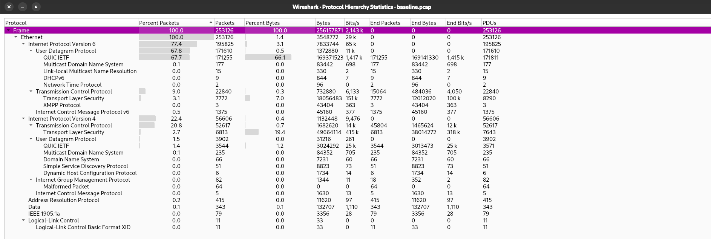
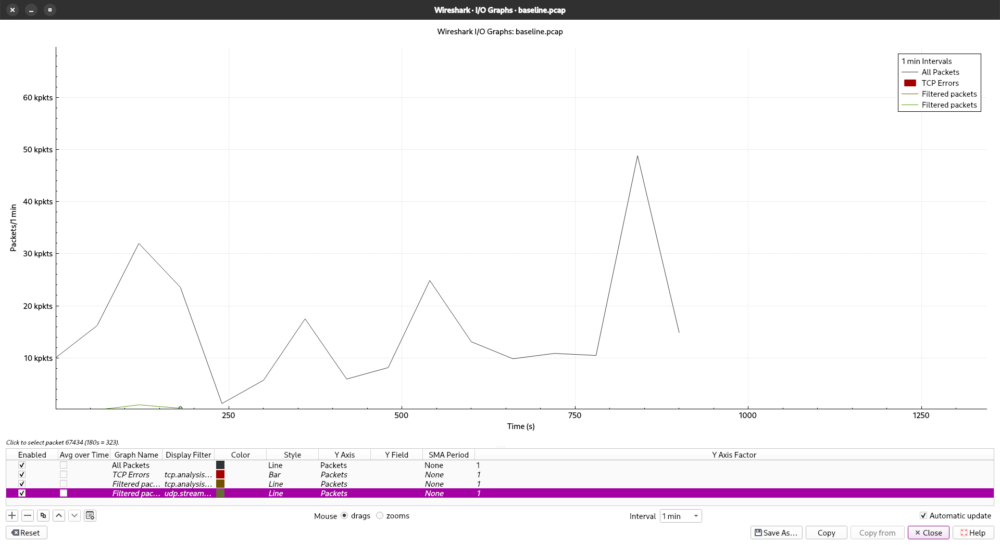
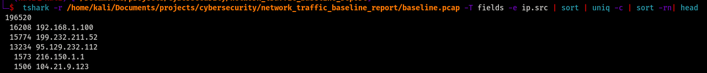
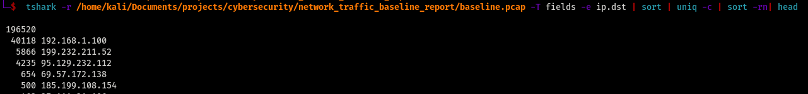
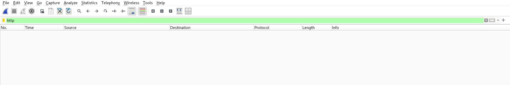
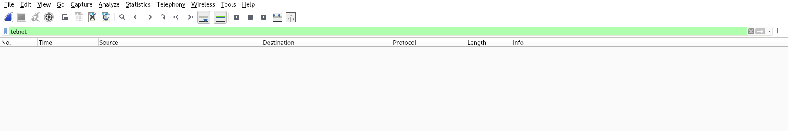
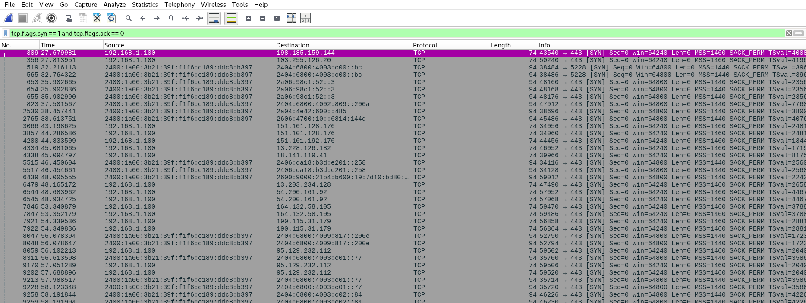
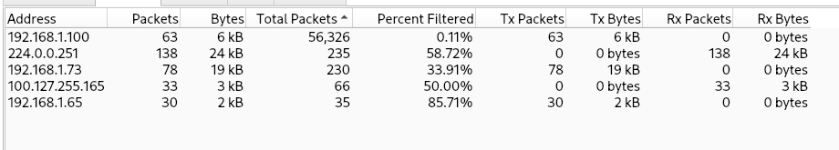

# Network Traffic Baseline Report

**Analyst:** Dipesh Sapkota
**Date:** 2026-03-25  
**Capture Duration:** 15 minutes  
**Interface:**  eth0   
**Capture File:** `baseline.pcap`  
**Total Packets Captured:** 253126
**Wireshark Version:** 4.6.4

---

## Executive Summary

A 15-minute passive network capture was performed on a home network to establish a traffic baseline and identify any security concerns. 253,126 total packets were captured across multiple protocols, and the network was found to be primarily encrypted.

> **Key finding:** 
All traffic was encrypted; however, high-volume QUIC traffic spikes and communication with less common external providers highlight the importance of monitoring traffic patterns and endpoint activity to ensure network security.

---

## 1. Device Identification


| Field            | Value                         |
|------------------|-------------------------------|
| Local IP         | 192.168.1.100                 |
| MAC Address      | ec:b1:d7:d7:45:95             |
| Gateway / Router | 192.168.1.254                 |
| DNS Resolver     | 100.127.255.165               |
| Network Type     | Ethernet                      |


---


## 2. Top 5 Source IP Addresses

| Rank | IP Address       | Packets | Organisation| Notes|
|------|------------------|---------|-----------------|-----|
| 1    | 192.168.1.100    | 16,208  |Internal network|Main workstation which initiated scan and  is primary source of traffic in the capture. Initiates DNS queries and establishes multiple TCP/HTTPS connections to external servers, indicating typical user browsing activity.|
| 2    |      199.232.211.52 |  51,774   | Fastly, Inc |High-volume outbound HTTPS traffic to CDN provider Fastly. Majority of packets are TCP ACKs, indicating the host is primarily receiving data (content download). Traffic likely with web browsing or application content delivery. No suspicious patterns observed.|                          
| 3    | 95.129.232.112 |     13,234    | DDOS-GUARD LTD|  High-volume HTTPS traffic with majority ACK packets from the host, indicating inbound data transfer. DDoS-Guard operates as a reverse proxy/CDN, suggesting traffic may be with a protected website or service. While behavior appears consistent with content delivery, the provider is less common; further verification via DNS resolution and user activity correlation is recommended.  |
| 4    |        216.150.1.1          |  1573    |  Vercel, Inc |High-volume HTTPS traffic to a frontend cloud platform. Packet info shows noramal TCP handsake indicating data transfer using TLSv1.
| 5    |     104.21.9.123 | 1,506  |Cloudflare, Inc|HTTPS traffic outbound to hosting server, acting primarily as a reverse proxy, content delivery network (CDN), and security layer|


---

## 3. Top 5 Destination IP Addresses


| Rank | IP Address       | Packets | Organisation  | Country       | Notes                         |
|------|------------------|---------|---------------|---------------|-------------------------------|
| 1    | 192.168.1.100    | 16,208  |Internal network|-|Main workstation which initiated scan and  is primary source of traffic in the capture. Initiates DNS queries and establishes multiple TCP/HTTPS connections to external servers, indicating typical user browsing activity.|
| 2    |  199.232.211.52  |  21,640 |Fastly, Inc    |  United States       |High-volume outbound HTTPS traffic to CDN provider Fastly. Majority of packets are TCP ACKs, indicating the host is primarily receiving data (content download). Traffic likely with web browsing or application content delivery. No suspicious patterns observed.|
| 3    |  95.129.232.112  |  17,469 |DDOS-GUARD LTD |  Russian Federation     |      High-volume HTTPS traffic with majority ACK packets from the host, indicating inbound data transfer. DDoS-Guard operates as a reverse proxy/CDN, suggesting traffic may be with a protected website or service. While behavior appears consistent with content delivery, the provider is less common; further verification via DNS resolution and user activity correlation is recommended.         |
|4| 69.57.172.138| 654|WHG Hosting Services Ltd |India| Outbound HTTPS traffic to web server running Nginx, normal website browsing activity.
|5| 185.199.108.154| 500| Fastly,Inc|United States|Outbound HTTPS traffic to CDN provider Fastly. Majority of packets are TCP ACKs, indicating the host is primarily receiving web traffic likely with web browsing or application content delivery. No suspicious patterns observed| 

---

## 4. Protocols Observed

| Protocol  | % of Traffic | Encrypted | Description                              |
|-----------|-------------|-----------|------------------------------------------|
| TLS       |     ~2.7     | ✅ Yes    | Encrypted web/app traffic (HTTPS)        |
| TCP       |     ~20.8      | —         | Transport layer connection management    |
| UDP       |     ~1.5   | —         | Connectionless transport layer           |
| DNS       |      0.0       | ⚠️ Partial| Domain name resolution queries           |
| ARP       |      0.2      | ❌ No     | Local network address mapping            |
| ICMP      |     ~0.5      | ❌ No     | Ping / network diagnostics               |
| HTTP      |      0.0       | ❌ No     | Unencrypted web traffic                  |
| mDNS      |     ~0.1      | ❌ No     | Local device discovery (Bonjour/Avahi)   |
| SSDP      |      0.0       | ❌ No     | UPnP device discovery                    |
| <!-- -->  |             |           |                                          |


**Screenshot:** 


---

## 5. Encryption Ratio


| Category         | Packet Count | % of Total |
|------------------|-------------|------------|
| Encrypted (TLS)  |     16568   |   100%     |
| Unencrypted      |         0   |      0     |
| **Total**        |     16568   |   100%     |

```
tshark -r baseline.pcap -Y "tls" | wc -l      # encrypted
tshark -r baseline.pcap -Y "http" | wc -l     # unencrypted HTTP
```

**Interpretation:**  "100% of traffic is TLS-encrypted, indicating good baseline security hygiene."

---


## 7. DNS Analysis


**DNS Resolver used:** 100.127.255.165 

```bash
# Top queried domains
tshark -r baseline.pcap -Y "dns.flags.response == 0" \
  -T fields -e dns.qry.name | sort | uniq -c | sort -rn | head 20
```

**Top 10 domains resolved:**

| Rank | Domain                                                 | Query Count | Category             |
| ---- | ------------------------------------------------------ | ----------- | -------------------- |
| 1    | kali                                                   | 15          | Internal             |
| 2    | main.vscode-cdn.net                                    | 12          | Software/CDN         |
| 3    | chrome.cloudflare-dns.com                              | 10          | DNS (DoH)            |
| 4    | mobile.events.data.microsoft.com                       | 3           | Telemetry            |
| 5    | westus-0.in.applicationinsights.azure.com              | 2           | Cloud Monitoring     |
| 6    | onedscolprdaus01.australiasoutheast.cloudapp.azure.com | 2           | Cloud Infrastructure |
| 7    | shed.dual-low.part-0040.t-msedge.net                   | 1           | CDN                  |
| 8    | shed.dual-low.part-0020.t-msedge.net                   | 1           | CDN                  |
| 9    | part-0040.t-0009.t-msedge.net                          | 1           | CDN                  |
| 10   | part-0020.t-0009.t-msedge.net                          | 1           | CDN                  |

> **Note any suspicious or unexpected domains** — No suspicious domains were observed, traffic was clean normal user browsing activity.

---

## 8. Broadcast & Multicast Traffic


- **ARP broadcasts:** ~2500 packets observed. Devices ( 192.168.1.100, 192.168.1.254, 192.168.1.73) are probing for gateway and peers
- **mDNS traffic:** Devices are advertising services such as Chromecast (_googlecast._tcp.local) and Xiaomi device discovery (_mi-connect._udp.local). Hostnames like Android-3.local indicate local device presence.
- **SSDP traffic:** UPnP discovery traffic observed via M-SEARCH requests, indicating presence of network devices such as routers.

**Filter used:** `eth.dst == ff:ff:ff:ff:ff:ff`

**Finding:** ARP broadcasts indicate multiple active devices communicating on the local subnet. mDNS traffic reveals service discovery from devices such as Android (Android-3.local) and IoT devices (e.g., Chromecast, Xiaomi). SSDP traffic suggests the presence of UPnP-enabled devices on the network.

---

## 9. TCP Lifecycle & Anomalies


### 9a. TCP Handshake observation

- **Filter used:** `tcp.flags.syn == 1 and tcp.flags.ack == 0`
- **Observation:** 
A TCP handshake was observed between [192.168.1.100] and [198.185.159.144] on port [443].
1. The client [192.168.1.100] initiated the connection with a SYN packet.
2. The server [198.185.159.144] responded with a SYN-ACK packet.
3. The client completed the handshake with an ACK packet.

This confirms a successful TCP three-way handshake.

### 9b. Retransmissions & errors

```bash
# Count TCP retransmissions
tshark -r /home/kali/Documents/projects/cybersecurity/network_traffic_baseline_report/baseline.pcap -Y "tcp.analysis.retransmission" | wc -l
```

- **Retransmission count:** 50
- **Interpretation:** 50 retransmissions out of 2,53,126 packets (~0.019%) indicates normal network conditions with minimal packet loss.
---

## 10. Traffic Volume Timeline


**Screenshot:** 

| Time Window    | Approx. Packets/min | Notable Activity            |
|----------------|---------------------|-----------------------------|
| 0:00 – 1:00    |          ~16250     | A TCP packet with RST, ACK flag was observed at around 60 seconds, indicating that the connection to port 443 (HTTPS) was abruptly terminated. This could be due to a reset by either client or server, possibly from a failed or closed session.                 |
| 1:00 – 5:00    |    ~31980           |     QUIC traffic from home router to workstation peaked at 120 s within this interval; encrypted payload (kp0) observed.|
| 5:00 – 10:00   |    ~2870            |            	Traffic slightly decreases but remains elevated; continued QUIC session activity.                 |
| 10:00 – 15:00  |     ~48820                | High-volume QUIC traffic from the home router to the workstation, with encrypted payload (kp0) and a peak traffic spike at 840 s within the 600–900 s observation window.                       |

**Traffic spikes explained:** Traffic analysis reveals an initial TCP reset at ~60 s, followed by QUIC traffic spikes at ~120 s and a larger surge at ~840 s, indicating intermittent high-bandwidth encrypted sessions.


---

## 11. Risk Findings Summary

 The network traffic analysis indicates a healthy and secure baseline for a home environment. All observed traffic was encrypted using TLS/QUIC, demonstrating good security practices. The identified traffic spikes were a result of intentional user activity (loading multiple webpages) and do not indicate malicious behavior. Minor anomalies, such as a TCP reset and communication with various external CDN/cloud providers, were consistent with normal web operations.

---

## 12. Recommendations

1. **[Limited visibility due to encryption]** — Maintain monitoring of encrypted traffic patterns using metadata (packet sizes, timing, endpoints) to detect anomalies, since payload inspection is not possible. Consider using endpoint security tools to complement network monitoring.

2. **[High-volume QUIC traffic spikes]** — Correlate traffic spikes with user activity or application logs to ensure bursts are legitimate. For networks with sensitive data, consider setting thresholds or alerts for unusual high-bandwidth activity.

3. **[Connection resets and external communication]** — Review connections to less common or foreign providers periodically to ensure all external traffic is authorized. Document any new services or destinations for future reference.

4. **[Broadcast & Multicast discovery protocols]** — Limit exposure of local services by configuring mDNS/SSDP appropriately or restricting these protocols to trusted devices, reducing the attack surface for local reconnaissance.

5. **Ongoing** — Re-run this baseline capture quarterly to detect new devices, protocol drift, or new unencrypted services introduced to the network.

---

## 13. Screenshots Index

| File                              | What it shows                              |
|-----------------------------------|--------------------------------------------|
|    | Full protocol hierarchy tree            |
|   | Top source IPs                |
|   | Top destination IPs                |
|      | Result of `http` display filter           |
|    | Result of `telnet` display filter         |
|      | HTTP stream follow (if applicable)        |
|     | I/O traffic volume over 15 minutes        |
|          | TCP SYN packet filter result              |
|          | Top DNS queries                           |

---

## Appendix — tshark Commands Used

```bash
# Capture 15 minutes on interface
tshark -i en0 -a duration:900 -w baseline.pcap

# Top source IPs
tshark -r baseline.pcap -T fields -e ip.src \
  | sort | uniq -c | sort -rn | head 10

# Top destination IPs
tshark -r baseline.pcap -T fields -e ip.dst \
  | sort | uniq -c | sort -rn | head 10

# Protocol hierarchy
tshark -r baseline.pcap -q -z io,phs

# Count HTTP packets
tshark -r baseline.pcap -Y "http" | wc -l

# HTTP hosts and URIs
tshark -r baseline.pcap -Y "http.request" \
  -T fields -e http.host -e http.request.uri

# Top DNS queries
tshark -r baseline.pcap -Y "dns.flags.response == 0" \
  -T fields -e dns.qry.name | sort | uniq -c | sort -rn | head 20

# Count TLS (encrypted) packets
tshark -r baseline.pcap -Y "tls" | wc -l

# TCP retransmissions
tshark -r baseline.pcap -Y "tcp.analysis.retransmission" | wc -l

# Broadcast traffic
tshark -r baseline.pcap -Y "eth.dst == ff:ff:ff:ff:ff:ff" | wc -l
```

---
> **Note:** The `.pcap` capture file is excluded from this repo due to file size.
> To reproduce: run `tshark -i <interface> -a duration:900 -w baseline.pcap`
*Report generated as part of Network Security Capstone Project — Network Traffic Baseline.*
