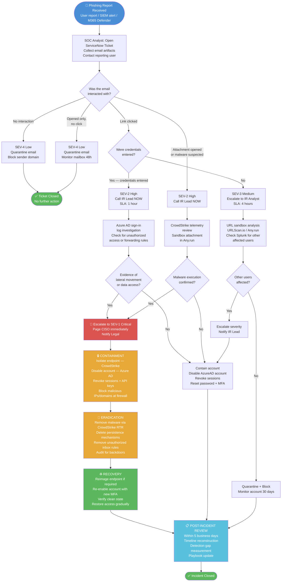

# Incident Response Flow Diagram

This diagram illustrates the full decision-based response flow for a phishing incident at NexaCore Technologies, from initial detection through post-incident review.

Copy the Mermaid code below and paste it into [mermaid.live](https://mermaid.live) to render the diagram. You can also export it as a PNG or SVG from that site to include as an image in documentation or presentations.

---

## Response Flow — Mermaid Diagram

---

## How to View This Diagram

**Option 1 — Mermaid Live Editor (easiest)**
1. Go to [mermaid.live](https://mermaid.live)
2. Paste the code block above (without the triple backticks) into the editor
3. The diagram renders on the right side instantly
4. Click **Export → PNG** to download it for your project

**Option 2 — GitHub renders Mermaid automatically**
GitHub natively renders Mermaid diagrams inside Markdown files. If you paste the mermaid code block directly into any `.md` file in your repository, it will display as a rendered diagram on GitHub — no extra steps needed.

**Option 3 — VS Code**
Install the "Markdown Preview Mermaid Support" extension and open this file in preview mode.

---

## Diagram Legend

| Color | Meaning |
|---|---|
| 🔵 Blue | Trigger / Start point |
| 🔴 Red | Critical escalation |
| 🟠 Orange | Active containment / eradication |
| 🟢 Green | Recovery or resolution |
| 🔷 Teal | Review and closure |
